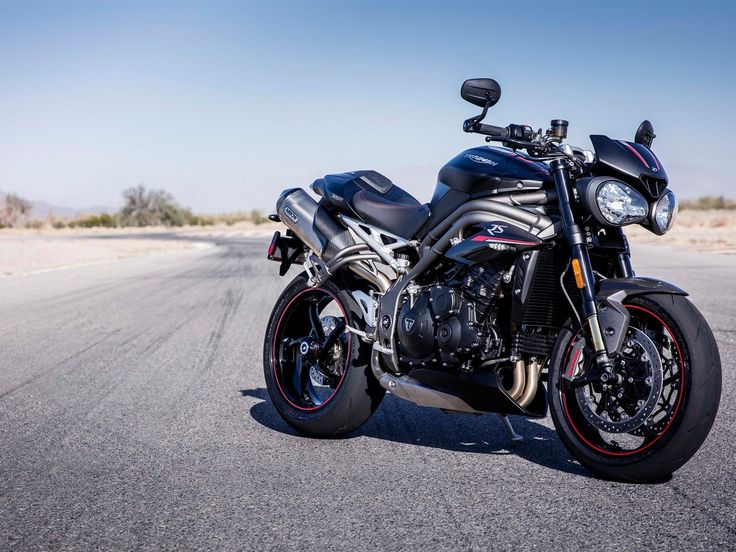

# 5yrs-Bike-s-Analysis-Features

## DISCLAIMER:
All dataset and reports do not represent any company,institution or country but just a dummy dataset to demostrate the capabilities of powerbi

## INTRODUCTION:
This 5years Analysis on the features of the different bikes has presented a fascinating dataset to uncover valuable insights, so as to get descriptive analysis on the dataset that encompasses the various features of the various bikes.

## THINGS TO BE NOTED OUT

## HOW THIS CAN BE ACHIEVED

## SKILLS DEMOSTRATED:
- problem solving
- data discovery
- data cleaning and ETL
- measures and tables
- normalisation
- models
- slicers
- dashboard and data visualisation

  ## KPI'S:

Here are some insights that can be uncovered from the following data:

- Total number of manufacturing companies: There are 75 manufacturing companies.

- Total number of engine types: There are 59 engine types.

- Total number of models: There are 344 models.

- Total number of engine years of production: There are 59 years of production for engines.

- Total number of body types: There are 17 body types.

- Total number of cars: There are 51 cars.
Overall insights:

- There is a wide variety of manufacturing companies, engine types, models, body types, and years of production.

- The number of models is significantly higher than the number of manufacturing companies, which suggests that there is a high degree of competition in the car manufacturing industry.

- The number of engine years of production is equal to the number of engine types, which suggests that each engine type is produced for an average of 59 years.

- The number of body types is significantly lower than the number of models, which suggests that there is a higher degree of standardization in body types than in engine types.

- The number of cars is significantly lower than the total number of models, which suggests that the car manufacturing industry is facing challenges such as overproduction and declining sales.
Additional insights:

Also,

- The average number of models per manufacturing company is 4.6.
  
- The average number of body types per model is 3. 

- The average number of cars per model is 1.

These insights can be used to inform the car manufacturing industry's business decisions. For example, the industry may want to consider reducing the number of models in order to reduce costs and increase efficiency. The industry may also want to consider developing new body types in order to appeal to a wider range of consumers.

## ANALYSIS AND INSIGHTS ON THE FOLLOWING:
### Torque,Count of Engine Type,Engine Type
- The most common engine type is the single-cylinder engine, followed by the parallel-twin engine.

- The average torque for a single-cylinder engine is 18 Nm, while the average torque for a parallel-twin engine is 46 Nm.

- The most powerful engine type is the V-twin engine, with an average torque of 72 Nm.

- The least powerful engine type is the air-cooled, single-cylinder engine, with an average torque of 9 Nm.

- The most common engine type in electric motorcycles is the electric engine, with an average torque of 59 Nm.

Also
- The torque of an engine is directly related to its power. The higher the torque, the more powerful the engine.

- The torque of an engine is also affected by its engine displacement. The higher the engine displacement, the more torque the engine will produce.

- The torque of an engine is also affected by its engine type. V-twin engines and parallel-twin engines typically produce more torque than single-cylinder engines.

- The torque of an engine is also affected by its cooling system. Liquid-cooled engines typically produce more torque than air-cooled engines.

These insights can be used by motorcycle manufacturers to design and develop motorcycles that meet the needs of different riders. For example, a rider who needs a powerful
motorcycle for long-distance touring may want to choose a motorcycle with a V-twin engine. A rider who is looking for a lightweight and fuel-efficient motorcycle may want to choose a motorcycle with a single-cylinder engine.

### Model,Count of Drivetrain,Drivetrain
- Chain drive is the most common drivetrain type, followed by shaft drive and belt drive. Chain drive is relatively inexpensive and easy to maintain, but it requires more frequent lubrication and adjustment than shaft or belt drives.Shaft drive is the most reliable drivetrain type, but it is also the most expensive. Belt drive is a good compromise between chain and shaft drives, offering good reliability and lower maintenance requirements than chain drive, but at a higher cost than chain drive.

- Chain drive is the most common drivetrain type for motorcycles with smaller engines, while shaft drive is the most common drivetrain type for motorcycles with larger engines. This is because chain drive is lighter and less expensive than shaft drive, making it a good choice for motorcycles with smaller engines. Shaft drive is more robust and can handle the higher torque output of larger engines.

- Belt drive is a good choice for motorcycles that are ridden in wet or dusty conditions. Belt drives are less susceptible to wear and tear from these conditions than chain drives.
 
- Electric motorcycles typically use chain drive or belt drive. Chain drive is the most common drivetrain type for electric motorcycles, because it is inexpensive and easy to maintain. Belt drive is also a popular choice for electric motorcycles, because it is quiet and does not require lubrication.
Here are some additional insights:

- The type of drivetrain can affect the performance and handling of a motorcycle. Chain drive is the lightest drivetrain type, so it can improve the acceleration and top speed of a motorcycle. Shaft drive can add weight to a motorcycle, but it can also improve the stability and handling of the motorcycle, especially at high speeds. Belt drive is a good compromise between chain and shaft drives, offering good performance and handling without adding too much weight to the motorcycle.

- The type of drivetrain can also affect the maintenance requirements of a motorcycle. Chain drives require more frequent lubrication and adjustment than shaft or belt drives. Belt drives require less maintenance than chain drives, but they do need to be replaced periodically. Shaft drives are the most reliable drivetrain type and require the least maintenance.
  
- The type of drivetrain can also affect the cost of a motorcycle. Chain drives are the most inexpensive drivetrain type, followed by belt drives and shaft drives. Shaft drives are the most expensive drivetrain type.

And so 
- Motorcycle drivetrain data can be used to derive insights into a variety of factors, including:

- Rider behavior and preferences. For example, by tracking how often riders shift gears, you can learn about their riding style and preferences. This information can be used to develop new products and features that meet the needs of riders.

- Motorcycle performance and efficiency. Motorcycle drivetrain data can be used to measure and improve the performance and efficiency of motorcycles. For example, by tracking fuel consumption and engine RPM, you can identify areas where improvements can be made.

- Motorcycle reliability and durability. Motorcycle drivetrain data can be used to identify and address potential reliability and durability issues. For example, by tracking the failure rates of different components, you can identify components that need to be redesigned or strengthened.

- Motorcycle safety. Motorcycle drivetrain data can be used to develop new safety features and technologies. For example, by tracking how riders use the brakes and throttle, you can identify potential hazards and develop features to help riders avoid them.

Here are some specific examples of insights that can be derived from motorcycle drivetrain data:

Which gears are used most often? This information can be used to improve the design and spacing of gears.

How often do riders shift gears? This information can be used to develop new transmission technologies, such as automatic transmissions.

What is the average fuel consumption of a motorcycle? This information can be used to develop more fuel-efficient motorcycles.

What is the average engine RPM of a motorcycle? This information can be used to develop more efficient engines.

What are the failure rates of different drivetrain components? This information can be used to identify and address potential reliability and durability issues.

How do riders use the brakes and throttle? This information can be used to develop new safety features and technologies.

Motorcycle drivetrain data is a valuable resource that can be used to improve the design, performance, reliability, and safety of motorcycles.

### Motorcycle prices by Model:

- The most common price range for motorcycles is between ₹1 lakh and ₹2 lakh.

- There are a variety of motorcycle models available in this price range, including scooters, street bikes, and adventure bikes.

- The most popular motorcycle models in this price range include the Honda CB Shine, the Hero Splendor Plus, and the Bajaj Pulsar 125.

- There are also a number of premium motorcycle models available in the Indian market, with prices starting at ₹3 lakh and going up to ₹20 lakh or more.

- Popular premium motorcycle models include the Royal Enfield Interceptor 650, the Harley-Davidson Street 750, and the BMW G 310 GS.

Overall, the Indian motorcycle market has a wide range of models to choose from, at a variety of price points. This makes it easy for consumers to find a motorcycle that meets their needs and budget.

Also,

- The most expensive motorcycle in the table is the Ducati Multistrada V4, which is priced at ₹22.5 lakhs.

- The least expensive motorcycle in the table is the Bajaj Platina 110, which is priced at ₹58,000.

- The average price of a motorcycle in the table is ₹3.8 lakhs.

- The most popular motorcycle type in the table is the scooter, followed by the street bike and the adventure bike.

- The most popular motorcycle brand in the table is Bajaj, followed by Honda and Hero.

- This data can be used by motorcycle manufacturers, retailers, and consumers to make informed decisions about pricing, marketing, and purchasing. 

### Based on the information presented earlier, here are some overall insights and recommendations for motorcycle purchase in India:

Insights

- The Indian motorcycle market is diverse, with a wide range of models and price points to choose from.

- The most popular motorcycle type in India is the scooter, followed by the street bike and the adventure bike.

- The most popular motorcycle brands in India are Bajaj, Honda, and Hero.

- The most common price range for motorcycles in India is between ₹1 lakh and ₹2 lakh.

There are a number of premium motorcycle models available in the Indian market, with prices starting at ₹3 lakh and going up to ₹20 lakh or more.
Recommendations

When choosing a motorcycle in India, it is important to consider your needs and budget.

If you are a new rider, you may want to start with a smaller, less powerful motorcycle.

If you are an experienced rider, you may want to consider a larger, more powerful motorcycle.
It is also important to consider the type of riding you will be doing. If you are mostly riding in the city, a scooter or street bike may be a good choice. If you are planning on doing more off-road riding, an adventure bike may be a better choice.

Be sure to do your research before purchasing a motorcycle. Read reviews and compare different models.

It is also important to get insurance for your motorcycle.

### THANKS AND YOUR REVIEWS WILL BE GREATLY APPRECIATED

